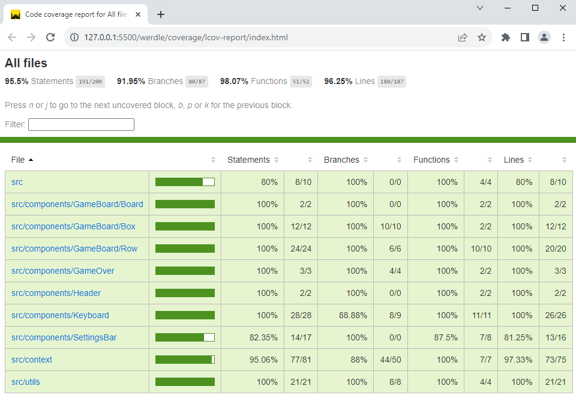

# Werdle - A Wordle Clone

A clone of the popular word game Wordle. Users can customize the word length and the number of turns allowed. In this version, guesses are no longer checked against the dictionary, so feel free to guess with a non-word! This project was built in React.

- Choose a word length anywhere from 4 to 11 characters
- Set the number of guesses from 3 all the way up to 10
- Utilizes over 2,300 words from the original game
- Built with React, utilizing some Bootstrap styling for the Game Over modal
- At this time, the layout is optimized for desktop, but I plan to enhance the responsiveness in the future

## How to Run

This project has been dockerized and is currently deployed to an AWS EC2 instance accessible at [https://werdle.nickbryant.dev/](https://werdle.nickbryant.dev/)

## Roadmap of Future Improvements

- Add responsiveness
- Refactor Components
- Link to custom "Secret Word" API
- Add dark/light mode switch

## Test Coverage Report

## Resources and Attributions

- Uses [hamburger menu](https://icons8.com/icon/k1Q9gcdbeRVn/hamburger-menu) PNG resource from [Icons8](https://icons8.com)

## License Information (MIT)

Permission is hereby granted, free of charge, to any person obtaining a copy of this software and associated documentation files (the "Software"), to deal in the Software without restriction, including without limitation the rights to use, copy, modify, merge, publish, distribute, sublicense, and/or sell copies of the Software, and to permit persons to whom the Software is furnished to do so, subject to the following conditions:

The above copyright notice and this permission notice shall be included in all copies or substantial portions of the Software.

THE SOFTWARE IS PROVIDED "AS IS", WITHOUT WARRANTY OF ANY KIND, EXPRESS OR IMPLIED, INCLUDING BUT NOT LIMITED TO THE WARRANTIES OF MERCHANTABILITY, FITNESS FOR A PARTICULAR PURPOSE AND NONINFRINGEMENT. IN NO EVENT SHALL THE AUTHORS OR COPYRIGHT HOLDERS BE LIABLE FOR ANY CLAIM, DAMAGES OR OTHER LIABILITY, WHETHER IN AN ACTION OF CONTRACT, TORT OR OTHERWISE, ARISING FROM, OUT OF OR IN CONNECTION WITH THE SOFTWARE OR THE USE OR OTHER DEALINGS IN THE SOFTWARE.
